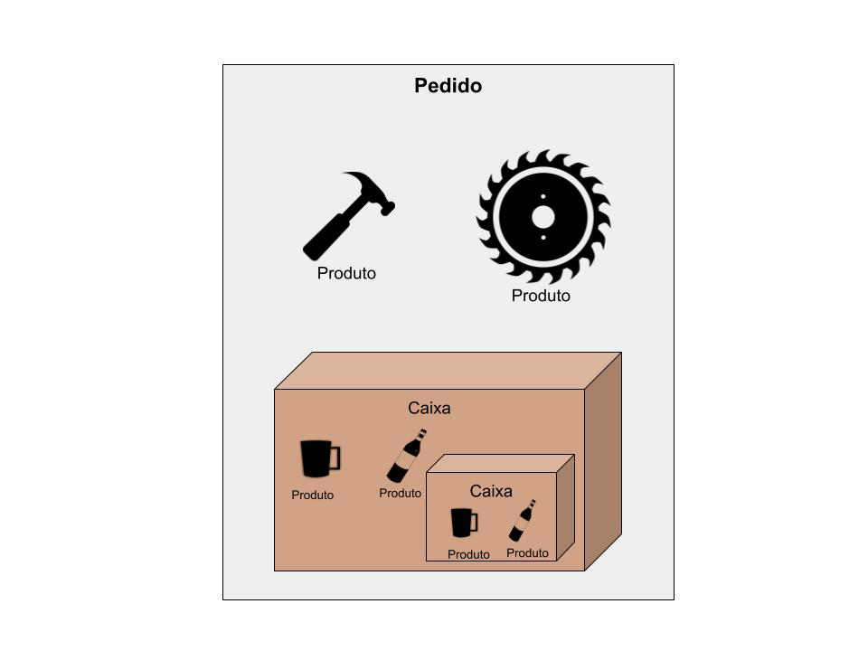
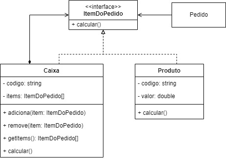

# Composite Pattern - PHP 
*Implementação do Composite Pattern Utilizando PHP*
<hr>

### Descrição
O Composite Pattern é um padrão de projeto estrutural que permite que você componha objetos em estrutura de árvores e então trabalhe com essas estruturas como se elas fossem objetos individuais. Referência: https://refactoring.guru/pt-br/design-patterns/composite

### Caso de Uso
<p> Neste exemplo simulamos o uso do Composite Pattern para calcular o preço dos items de um pedido. 
Até este ponto é algo bem comum e poderíamos resolver simplesmente usar uma 
estrutura de repetição e armazenar a soma do valor de cada item em uma variável auxiliar e retornar seu valor. </p>

<p> Mas para este exemplo, o pedido é composto por itens e este itens podem ser produtos ou caixas que contém produtos.



Ao mentalizarmos este requisito, começamos a pensar em como diferenciar os objetos Produtos dos objetos Caixas. 
Sim, isto seria uma saída, mas e se tivéssemos 3, 4, 5, n.. objetos direferentes isto se tornaria em um verdadeiro quebra-cabeça.

Por este motivo temos Composite Pattern.
Com o Composite Pattern podemos executar um método que é comum a todos os elementos da estrutura sem nos preocupar em saber o tipo do objeto que está sendo iterado é um produto ou uma caixa com produtos.

Agora vamos ao exemplo!

### Estrutura Composite Pattern


A estrutura do Composite Pattern tem os seguintes elementos: Component, Leaf, Composite e Client.

Agora vamos entender cada um desse componentes e realizar as associações com o nosso caso de uso:

#### Component
O Component é uma interface que define as operações que são comuns para os elementos simples(Leaf) ou complexos(Composite), ela é a nossa árvore na estrutura.
Em nosso caso de uso, o Component é o item do pedido. O item do pedido é composto por produtos(elementos simples) ou caixas(elementos complexos).

#### Leaf
A Leaf ou folha representa o componente simples da árvore. Realizando a associação com o nosso caso de uso, o leaf será representado pelo objeto Produto.

#### Composite
O Composite ou Container é o elemento complexo da arvore, o Composite pode conter elementos simples ou compostos.
Em nosso caso de uso é a Caixa, ela pode conter os produtos(elementos simples) ou conter caixas(elementos compostos) com outras caixa ou produtos dentro delas.

#### Client
O Client é o elemento que irá trabalhar com os elementos(Component) sem se importar se é um elemento simples ou composto. Para o Client os elementos são indiferentes. Por utilizar a interface Component para interagir com os elementos, ele não sabe se é uma Leaf ou um Composite.
Em nosso caso de uso o Client é representado pelo objeto Pedido. O pedido irá interagir apenas com os items(Component) sem se importar se são Produtos(Leaf) ou Caixas(Composite).

### Diagrama do Caso de Uso com o Composite Pattern

Agora que sabemos o conceito do Composite Pattern vamos aplicá-lo ao nosso caso de uso.



### Codificação
Vamos começar com a interface _ItemDoPedido.php_.
````php
<?php

/**
 * Representa o Component do Composite Pattern
 * @author Anglesson Araujo
 */
interface ItemDoPedido
{
  public function calcular();
}
````

Agora vamos codificar a nossa Leaf: _Produto.php_.
````php
<?php

/**
 * Representa o Leaf(Folha) do Composite Pattern
 * @author Anglesson Araujo
 */
class Produto implements ItemDoPedido
{
    private string $codigo;
    private float $valor;

    public function __construct(string $codigo)
    {
        $this->codigo = $codigo;
    }

    /**
     * Método responsável por retornar o valor do produto.
     * @return float Valor do Produto
     */
    public function calcular()
    {
      return $this->valor;
    }

    /**
    * Método responsável por definir o valor do produto.
    * @param float Preço do Produto
    */
    public function setValor(float $valor)
    {
      $this->valor = $valor;
    }

    /**
     * Método responsável por retornar o valor do produto.
     * @return string Código do produto.
     */
    public function getCodigo()
    {
        return $this->codigo;
    }
}
````

O nosso Composite é a Caixa. _Caixa.php_.
````php
<?php

/**
 * Representa o Composite ou Container do Composite Pattern
 * @author Anglesson Araujo
 */
class Caixa implements ItemDoPedido
{
  private $codigo;
  private $items;

  public function __construct($codigo)
  {
      $this->items = [];
      $this->codigo = $codigo;
  }

  /**
   * Método responsável por adicionar items à Caixa.
   * @param ItemDoPedido Objeto do tipo ItemDoPedido
   */
  public function adiciona(ItemDoPedido $item)
  {
    $this->items[] = $item;
  }

  /**
   * Método responsável por remover item da Caixa.
   * @param ItemDoPedido Item do Pedido
   */
  public function remove(ItemDoPedido $item)
  {
    $key = array_search($item, $this->items);
    if($key!==false){
        unset($this->items[$key]);
    }
  }

  /**
   * Método responsável por retornar todos os items da Caixa.
   * @return array Lista de items que compõem a caixa.
   */
  public function getItens()
  {
    return $this->items;
  }

  /**
   * Método responsável por definir o código da caixa.
   * @param string Codigo da caixa
   * @return void
   */
  public function setCodigo(string $codigo)
  {
    $this->codigo = $codigo;
  }

  /**
   * Método responsável retornar o código da caixa.
   * @return string Codigo da caixa
   */
  public function getCodigo()
  {
    return $this->codigo;
  }

  /**
   * Método responsável por delegar a atividade de calculo para os items que compõe a caixa.
   * @return float Soma dos produtos na caixa.
   */
  public function calcular()
  {
    $soma = 0;
    foreach ($this->items as $item)
    {
      $soma = $soma + $item->calcular();
    }
    return $soma;
  }
}

````

Para concluirmos, vamos codificar o Client _Pedido.php_.
````php
<?php
/**
 * Representa o Client do Composite Pattern.
 * @author Anglesson Araujo
 */
class Pedido
{
    private $items;
    private string $codigo;

    /**
     * Método contrutor da classe
     * @param string $codigo
     */
    public function __construct(string $codigo)
    {
        $this->codigo = $codigo;
        $this->items = [];
    }

    /**
     * Método responsável por adicionar itens ao pedido.
     * @param ItemDoPedido $item Item do pedido pode ser um Produto ou uma Caixa.
     * @return void
     */
    public function adicionarItem(ItemDoPedido $item)
    {
        $this->items[] = $item;
    }

    /**
     * Método responsável por remover item da Caixa.
     * @param ItemDoPedido Item do Pedido
     */
    public function removerItem(ItemDoPedido $item)
    {
        $key = array_search($item, $this->items);
        if($key!==false){
            unset($this->items[$key]);
        }
    }

    /**
     * Método responsável por retornar a soma de todos os items,
     * independente se são caixas com produtos ou apenas produtos.
     * @return int|mixed
     */
    public function finalizarPedido()
    {
        $total = 0;
        foreach ($this->items as $item)
        {
            $total = $total + $item->calcular();
        }
        return $total;
    }

    /**
     * Método responsável por retornar o código do produto.
     * @return string
     */
    public function getCodigo()
    {
        return $this->codigo;
    }
}
````

Vamos testar nossa implemtação com o arquivo index.php
````php
<?php

include_once 'ItemDoPedido.php';
include_once 'Produto.php';
include_once 'Caixa.php';
include_once 'Pedido.php';

// Cria produtos
$produto1 = new Produto('001');
$produto1->setValor(5.00);

$produto2 = new Produto('002');
$produto2->setValor(15.00);

$produto3 = new Produto('003');
$produto3->setValor(50);

$produto4 = new Produto('004');
$produto4->setValor(234.00);

// Cria Caixa Filha
$caixaFilha = new Caixa('CXFILHA001');
$caixaFilha->adiciona($produto3);
$caixaFilha->adiciona($produto4);

// Cria Caixa Mãe
$caixa = new Caixa('CXMAE001');
$caixa->adiciona($produto1);
$caixa->adiciona($produto2);
$caixa->adiciona($caixaFilha);

// Classe Pedido representa a classe cliente.
$pedido = new Pedido('PED123');
$pedido->adicionarItem($caixa);

echo "O valor do PEDIDO - {$pedido->getCodigo()} é R$ ".$pedido->finalizarPedido()."\n";
````

Como vocês podem ver toda a 'mágica' acontece na função finalizarPedido() da classe Pedido.php. Nela realizamos a iteração sem nos preocupar em verificar se são caixas ou apenas produtos. Além disso, também não nos preocupamos em saber quantos os níveis de caixas que estão compondo-as.

Espero ter ajudado!# composite-pattern-php

